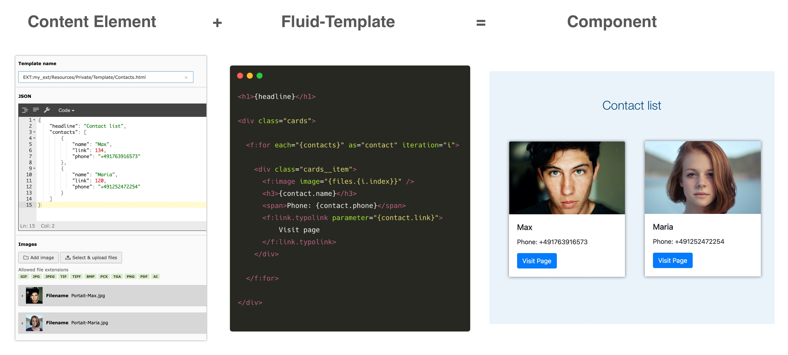
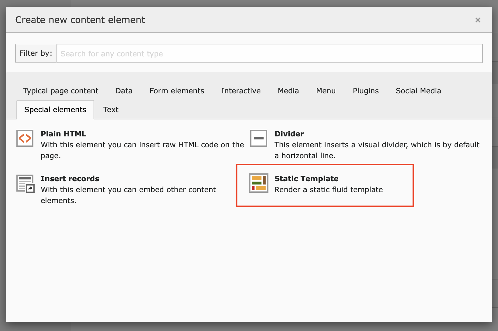
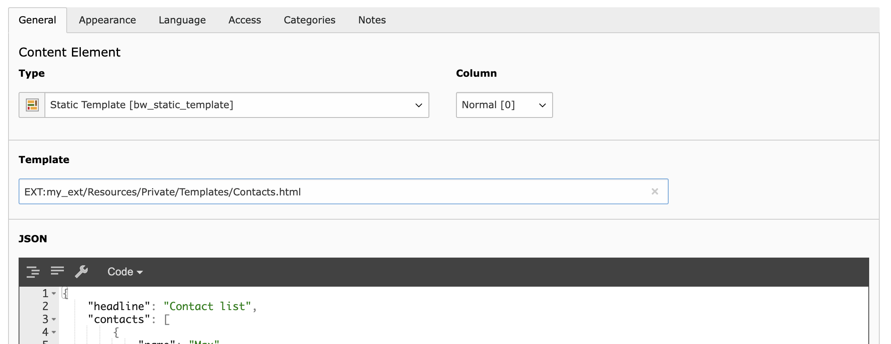

Static Template CE
==================

This TYPO3 extension ships a custom content element that renders every Fluid template. Inject JSON data or FAL files into the templates. Perfect for fast template development.

Why?
----

* Sometimes content is very unlikely to change regularly. It's faster to immediately write a Fluid template than to create a custom content element.
* No need to write TCA or TypoScript to get frontend output that can be adjusted through the backend. (E.g. quick image or phone number change)
* If a standalone solution is required, the templates can be reused.

.. tip::

    Perfect if your customer is lazy and never thinks about logging into the backend to do the changes by their own.

Installation
------------

.. rst-class:: bignums-tip

    1. Install via composer

        .. code:: bash

            composer require blueways/bw-static-template

        .. note::

            Requires ``blueways/bw-jsoneditor ^2.0`` and TYPO3 ``^13.4 || ^14.2``.

    2. Add the site set ``blueways/bw-static-template`` to your site configuration:

        .. code:: yaml

            # config/sites/<your-site>/config.yaml
            sets:
                - blueways/bw-static-template

Usage
-----

Add the content element **Static Template** to a page.

Header
~~~~~~

The standard TYPO3 **Header** field is available and rendered above the content element preview in the backend page module.

Select a template
~~~~~~~~~~~~~~~~~

Enter a Fluid template path in the **Frontend template** field:

* A template name (e.g. ``MyTemplate``) — resolved against the configured ``templateRootPaths``
* A full EXT: path (e.g. ``EXT:your_ext/Resources/Private/Templates/MyTemplate.html``)

Save & done.

Pass data into the template (optional)
~~~~~~~~~~~~~~~~~~~~~~~~~~~~~~~~~~~~~~~

Enter valid JSON in the **JSON** field:

.. code:: json

    {
        "templateMarker1": "Example marker data",
        "persons": [
            {
                "name": "Markus Mustermann",
                "contactUid": 3
            },
            {
                "name": "Paul Werner",
                "contactUid": 4
            }
        ]
    }

Now you can use the given data in your template, e.g.:

.. code:: html

    Hello {templateMarker1}!

    <f:for each="{persons}" as="person">
        Say hello to <f:link.page pageUid="{person.contactUid}">{person.name}</f:link.page>
    </f:for>

Load JSON from file (optional)
~~~~~~~~~~~~~~~~~~~~~~~~~~~~~~~

Toggle **Use database** off to load JSON from a file path instead of the inline editor. Enter a relative or ``EXT:`` path in the **JSON file path** field. Remote URLs are also supported.

Select images (optional)
~~~~~~~~~~~~~~~~~~~~~~~~~

The selected images are accessible as :file:`FileReference` objects via the ``{files}`` variable:

.. code:: html

    <f:for each="{files}" as="file">
        <f:image image="{file}" />
    </f:for>

Backend preview template (optional)
~~~~~~~~~~~~~~~~~~~~~~~~~~~~~~~~~~~~~

Enter a template name or ``EXT:`` path in the **Backend preview** field to render a custom Fluid template in the backend page module preview instead of the default JSON table view. The same JSON data and file variables are available as in the frontend template.

Configuration
-------------

Constants
~~~~~~~~~

Configure the template root paths so that the template name entered in the TCA field is resolved correctly:

.. code:: typoscript

    plugin.tx_bwstatictemplate {
        view {
            templateRootPath =
            partialRootPath =
            layoutRootPath =
        }
    }

Setup
~~~~~

The content element is rendered like any other ``lib.contentElement``-based element. Use standard TypoScript to inject additional data:

.. code:: typoscript

    tt_content.bw_static_template {

        # insert variables
        variables {
            foo = TEXT
            foo.value = bar
        }

        # use DataProcessor (indexes 10 and 20 are reserved)
        dataProcessing {

            # Inject a menu
            30 = TYPO3\CMS\Frontend\DataProcessing\MenuProcessor
            30 {
                as = navigation
                entryLevel = 0
            }

            # Inject data about the current page
            40 = TYPO3\CMS\Frontend\DataProcessing\DatabaseQueryProcessor
            40 {
                table = pages
                pidInList = this
                as = page
            }
        }
    }

Contribute
----------

This extension was made by Maik Schneider. Feel free to contribute!

* `GitHub Repository <https://github.com/maikschneider/bw_static_template/>`__

Thanks to `blueways <https://www.blueways.de/>`__ and `XIMA <https://www.xima.de/>`__!
