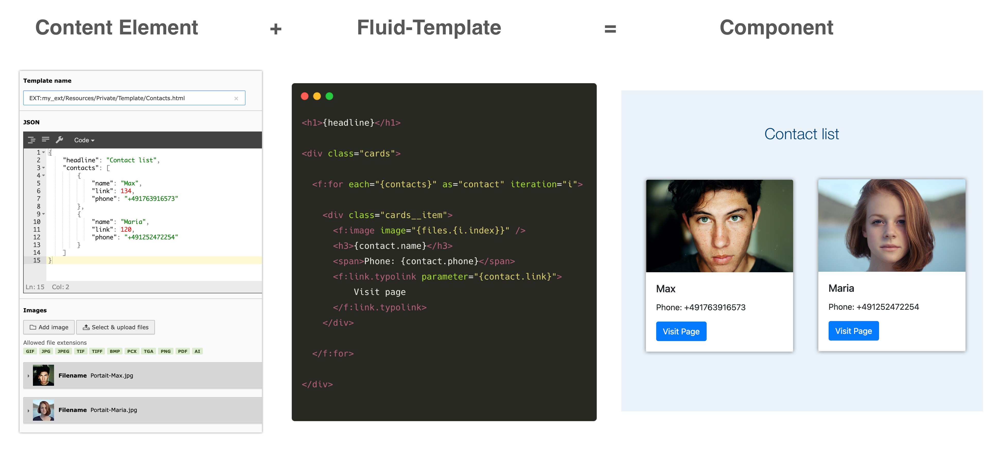
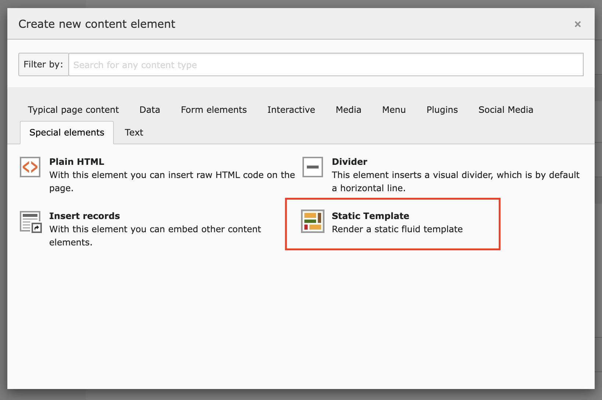
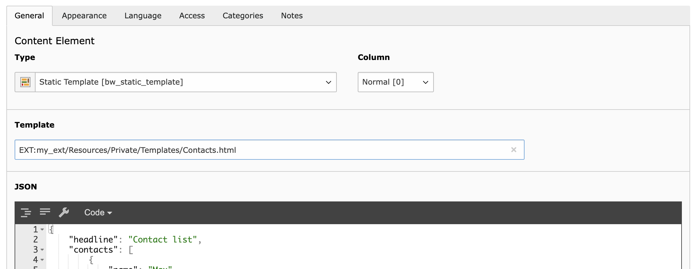

Static Template CE
==================

Custom content element that renders every fluid template. Inject JSON data or FAL files into the templates. Perfect for fast template development.

Why?
----

* Sometimes content is very unlikely to change regularly. It's faster to
  immediately write a fluid template than start the creation of a custom content element or adjusting an extension to your needs.
* No need to write TCA or TypoScript to get frontend output, that can be adjusted through the backend. (E.g. quick image or phone number change)
* If it's required to implement a standalone solution, the templates can be reused

.. tip::

   Perfect if your customer is lazy and never thinks about logging into the backend to do the changes by his own.

Installation
------------

.. rst-class:: bignums-tip

1. Install via composer

   .. code:: bash

      composer require blueways/bw-static-template

   Or install via Extension Manager, in this case you can skip step 2.

2. Include static TypoScript template

3. Include static PageTS template

Usage
-----

Add content element to page and select a fluid template to render (e.g.: :file:`EXT:your_ext/Resources/Private/Partials/Header.html`).

Save & done.

Pass data into template (optional)
~~~~~~~~~~~~~~~~~~~~~~~~~~~~~~~~~~

Enter valid JSON:

.. code:: typoscript

   {
      "templateMarker1": "Example marker data",
      "persons": [
         {
            "name": "Markus Mustermann",
            "contactUid": 3
         },
         {
            "name": "Paul Werner",
            "contactUid": 4
         }
      ]
   }

Now you can use the given data in your template, e.g.:

.. code:: html

   Hello {templateMarker1}!

   <f:for each="{persons}" as="person">
      Say hello to <f:link.page pageUid="{person.contactUid}">{person.name}</f:link.page>
   </f:for>

Select images (optional)
~~~~~~~~~~~~~~~~~~~~~~~~

The selected images are accessible as :file:`FileReference` via :file:`files` marker:

.. code:: html

   <f:for each="{files}" as="file">
      <f:image image="{file}" />
   </f:for>

Configuration
-------------

Constants
~~~~~~~~~

If you want to use the Layouts and Partials of fluid_styled_content, you just need to set the paths to the ones of your :file:`styles.content` configuration:

.. code:: typoscript

   plugin.tx_bwstatictemplate_pi1 {
      view {
         templateRootPath =
         partialRootPath =
         layoutRootPath =
      }
   }

Setup
~~~~~

It's just a regular content element that is rendered like every other element of fluid_style_content. Here are some examples to inject some additional data into the templates:

.. code:: typoscript

   tt_content.bw_static_template {

       # insert variables
       variables {
           foo = TEXT
           foo.value = bar
       }

       # use DataProcessor (10 and 20 are reserved indexes)
       dataProcessing {

           # Inject a menu
           30 = TYPO3\CMS\Frontend\DataProcessing\MenuProcessor
           30 {
               as = navigation
               entryLevel = 0
           }

           # Inject data about the current page
           40 = TYPO3\CMS\Frontend\DataProcessing\DatabaseQueryProcessor
           40 {
               table = pages
               pidInList = this
               as = page
           }
       }
   }

Upgrade from 1.x to 2.x
-----------------------

The type of content element moved from plugin to custom content element. Plugins added to your page will still work, but cannot be added anymore.

There is an Update Wizard that migrates all of your plugins at once.

Run it via command line (:file:`typo3cms upgrade:run bwStaticTemplate_pluginUpdateWizard`) or upgrade wizard in the backend.

Help & Contribution
-------------------

This extension was made by Maik Schneider from `blueways <https://www.blueways.de/>`__. Use the `issue tracker <https://bitbucket.org/blueways/bw_static_template/issues>`__ for bugs and feature requests. If you have any questions, you can `hit me up <https://slack.com/app_redirect?channel=C02KWTE8JRE>`__ at the TYPO3 Slack.

Feel free to contribute!

* `Bitbucket-Repository <https://bitbucket.org/blueways/bw_static_template/>`__
