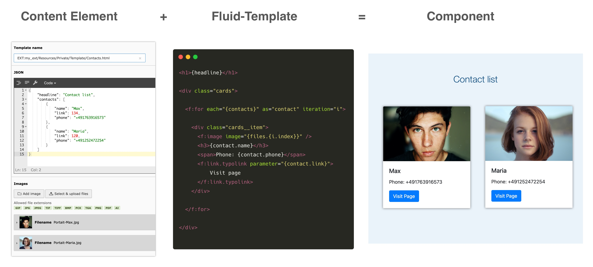
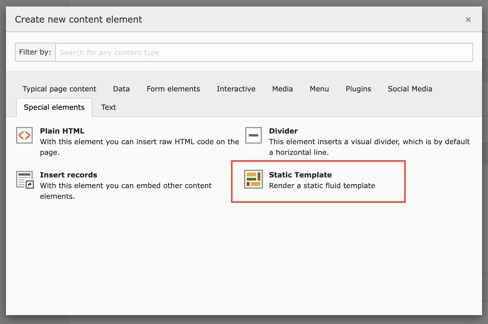
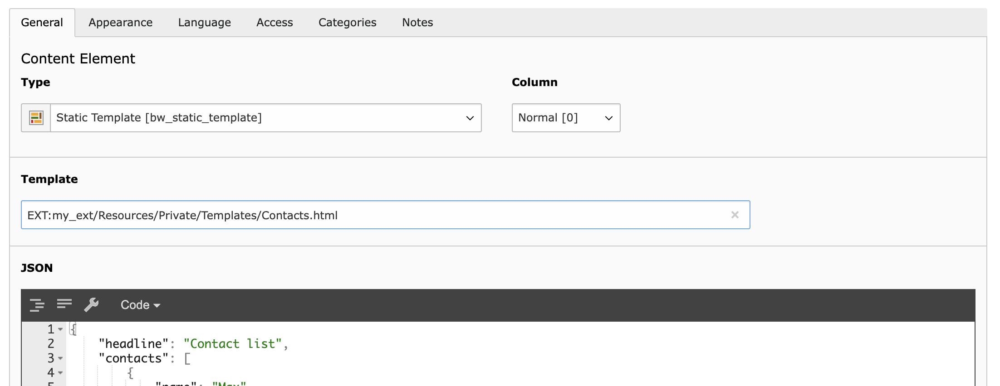

# Static Template TYPO3 extension

Custom content element that renders every fluid template. Inject JSON data or FAL files into the templates. Perfect for fast template development.



* Sometimes content is very unlikely to change regularly. It's faster to
immediately write a fluid template than start the creation of a custom content element or adjusting an extension to your needs.
* No need to write TCA or TypoScript to get frontend output, that can be adjusted through the backend. (E.g. quick image or phone number change)
* Perfect if your customer is lazy and never thinks about logging into the
backend to do the changes by his own
* If it's required to implement a standalone solution, the templates can be reused

## Install

1. Install via composer:

    ```
    composer require blueways/bw-static-template
    ```

2. Include static TypoScript template
3. Include static PageTS template

## Usage

Add content element to page



Select fluid template to render (e.g.: ```EXT:your_ext/Resources/Private/Partials/Header.html```)



Save & done.

### Optional: Pass data into template

Enter valid JSON:

```json
{
    "templateMarker1": "Example marker data",
    "persons": [
        {
            "name": "Markus Mustermann",
            "contactPid": 3
        },
        {
            "name": "Paul Werner",
            "contactPid": 4
        }
    ]
}
```

Now you can use the given data in your template, e.g.:

```html
Hello {templateMarker1}!

<f:for each="{persons}" as="person">
    Say hello to <f:link.page pageUid="{person.contactPid}">{person.name}</f:link.page>
</f:for>
```

### Optional: Select images

The selected images are accessible as **FileReference** via ```{files}``` marker.

```html
<f:for each="{files}" as="file">
    <f:image image="{file}" />
</f:for>

```

## Configuration

### Constants

If you want to use the Layouts and Partials of fluid_styled_content, you just need to set the paths to the ones of your `styles.content` configuration:

```
plugin.tx_bwstatictemplate_pi1 {
    view {
        templateRootPath =
        partialRootPath =
        layoutRootPath =
    }
}
```

### TypoScript

It's just a regular content element that is rendered like every other element of fluid_style_content. Here are some examples to inject some additional data into the templates:

```
tt_content.bw_static_template {

    # insert variables
    variables {
        foo = TEXT
        foo.value = bar
    }

    # use DtaProcessor (10 and 20 are reserved indexes)
    dataProcessing {
        # Inject a menu
        30 = TYPO3\CMS\Frontend\DataProcessing\MenuProcessor
        30 {
            as = navigation
            entryLevel = 0
        }

        # Inject data about the current page
        40 = TYPO3\CMS\Frontend\DataProcessing\DatabaseQueryProcessor
        40 {
            table = pages
            pidInList = this
            as = page
        }
    }
}
```

## Upgrade from version 2.x to 3.x

1. Migrate database fields
2. Adjust PageTS include

**1. Database migration**

In version 3 the default `header` and `bodytext` fields of tt_content aren't used anymore, new fields for template name and json content have been introduced.

To migrate your existing content elements, run the shipped upgrade wizard via backend or command line:

```
typo3 upgrade:run bwStaticTemplate_v3UpgradeWizard
```

**2. PageTS path**

The PageTS config file path changed. Check your include:

* Old: `EXT:bw_static_template/Configuration/PageTS/All.txt`
* New: `EXT:bw_static_template/Configuration/page.tsconfig`

## Contribute

This extension was made by Maik Schneider: Feel free to contribute!

* [Github-Repository](https://github.com/maikschneider/bw_static_template)

Thanks to [blueways](https://www.blueways.de/) and [XIMA](https://www.xima.de/)!
