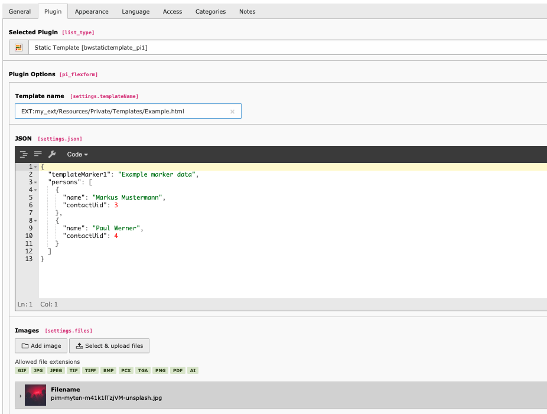

# Static Template TYPO3 extension

Frontend plugin that renders fluid templates. Inject JSON data or FAL files into the templates. Perfect for fast
template development with example data.



## Install

* via composer:

```
composer require blueways/bw-static-template
```

* include static typoscript template
* include static pageTS template

## Usage

### Add plugin to page

Select fluid template to render (e.g.: ```EXT:your_ext/Resources/Private/Partials/Header.html```)

### Optional: Pass data into template

Enter valid JSON:

```json
{
	"templateMarker1": "Example marker data",
	"persons": [
		{
			"name": "Markus Mustermann",
			"contactUid": 3
		},
		{
			"name": "Paul Werner",
			"contactUid": 4
		}
	]
}
```

Now you can use the given data in your template, e.g.:

```
Hello {templateMarker1}!

<f:for each="{persons}" as="person">
	Say hello to <f:link.page pageUid="{person.contactUid}">{person.name}</f:link.page>
</f:for>
```

### Optional: Select images

The selected images are accessible as **FileReference** via ```{files}``` marker.

```
<f:for each="{files}" as="file">
	<f:image image="{file}" />
</f:for>
			 
```

## Contribute

This extension was made by Maik Schneider from [blueways](https://www.blueways.de/). Feel free to contribute! 

* [Bitbucket-Repository](https://bitbucket.org/blueways/bw_static_template)


